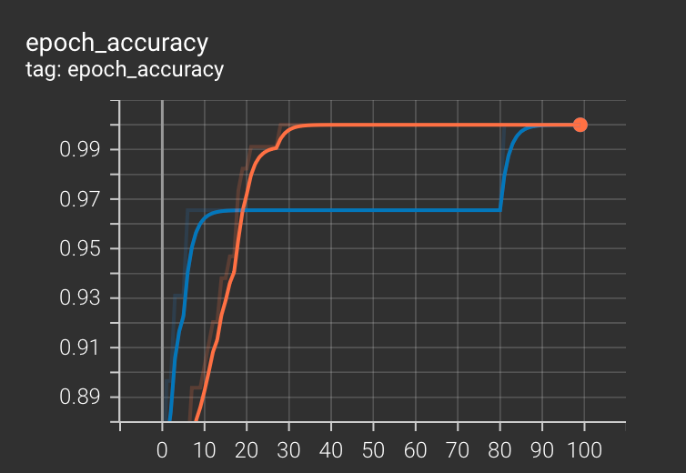
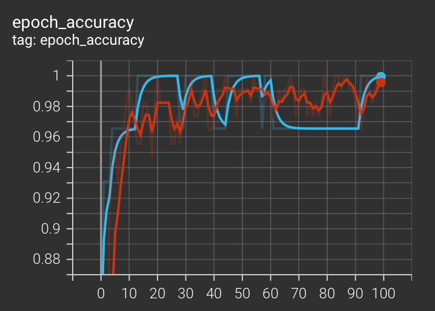
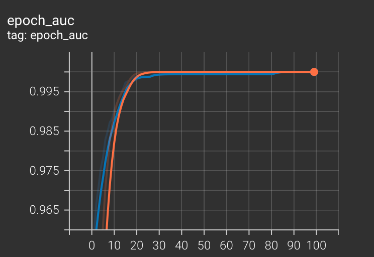
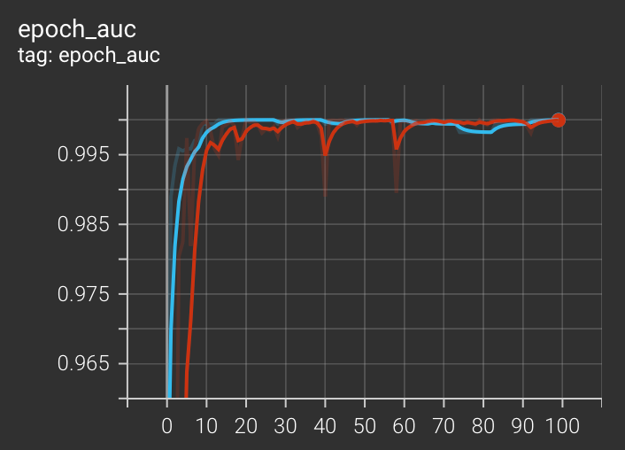
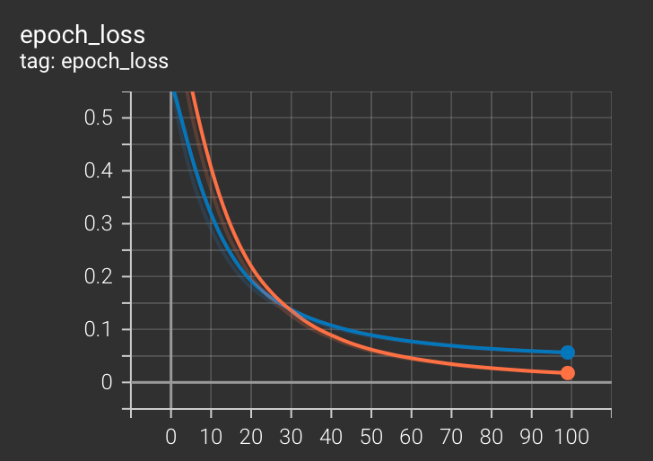
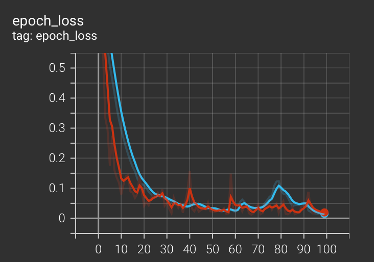

# Raport

## Opis modeli

Zaimplementowano i przetestowano dwa modele sieci neuronowych do klasyfikacji win:

1.  **Model Prosty**:
    *   **Architektura**: Jedna warstwa ukryta (16 neuronów, aktywacja ReLU) oraz warstwa wyjściowa (3 neurony, aktywacja Softmax).
    *   **Liczba parametrów**: 275.

2.  **Model Złożony**:
    *   **Architektura**: Trzy warstwy ukryte (128, 64, 32 neurony) z aktywacją ReLU + BatchNormalization + Dropout
    *   **Liczba parametrów**: 12,995.

## Krzywe uczenia

| Metryka | Model Prosty (niebieski: validation, pomarańczowy: training) | Model Złożony (niebieski: validation, czerwony: training) |
| :--- | :---: | :---: |
| **Accuracy** |  |  |
| **AUC** |  |  |
| **Loss** |  |  |

Oba modele osiągają bardzo podobne wyniki, a krzywe uczenia sugerują, że model prosty uczy się trochę wolniej, ale znacznie stablniej.

## Przykładowe wyniki

| Metryka | Model Prosty | Model Złożony |
| :--- | :--- | :--- |
| **Test Accuracy** | 94.44% | 94.44% |
| **Test AUC** | 0.9946 | 0.9952 |
| **Test Loss** | 0.1340 | 0.2211 |

## Podsumowanie i wnioski

Model prosty osiągnął wyniki zbliżone lub lepsze niż model złożony, mimo znacznie mniejszej liczby parametrów.
Prawdopodobnie wynika to z faktu, że zbiór danych win jest stosunkowo prosty, ma relatywnie mało cech i nie wymaga skomplikowanej architektury do skutecznej klasyfikacji.
