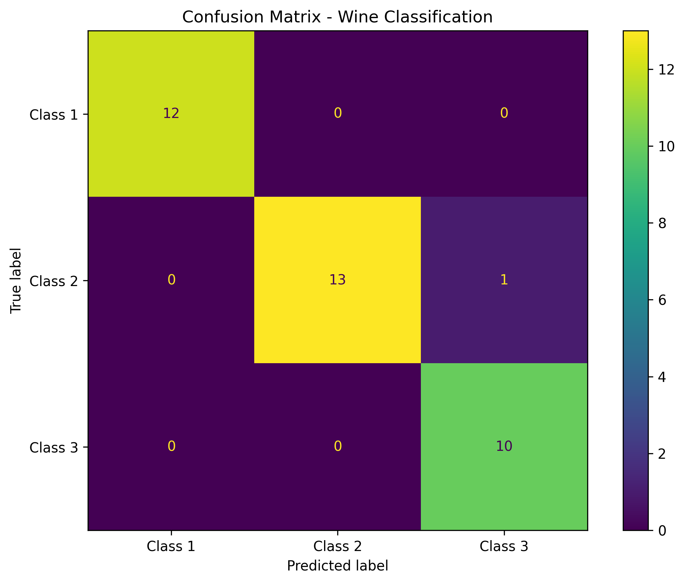

# Podsumowanie

Testowane parametry:
- Learning rate: <1e-4, 5e-3>
- Liczba neuronów w pierwszej warstwie ukrytej: 16-64, step 16
- Aktywacja: relu, tanh, sigmoid

Do tuningu użyty został algorytm Hyperband.

## Zoptymalizowany model:

| Layer (type)              | Output Shape   | Param # |
|---------------------------|---------------|---------|
| normalization (Normalization) | (None, 13)  | 27      |
| hidden_layer_1 (Dense)    | (None, 64)    | 896     |
| output_layer (Dense)      | (None, 3)     | 195     |

Total params: 3,302 (12.91 KB)  
Trainable params: 1,091 (4.26 KB)  
Non-trainable params: 27 (112.00 B)  
Optimizer params: 2,184 (8.54 KB)  

### Finalne parametry:
learning_rate: 0.0038512781407378416  
hidden_units_1: 64  
activation: relu  

## Porównanie do baseline

| Metric         | Baseline         | Tuned            | Improvement         |
|---------------|------------------|------------------|---------------------|
| Test Loss     | 0.2211           | 0.1005           | +0.1206             |
| Test Accuracy | 0.9444 (94.44%)  | 0.9722 (97.22%)  | +0.0278 (+2.78%)    |
| Test AUC      | 0.9952           | 0.9973           | +0.0021             |

